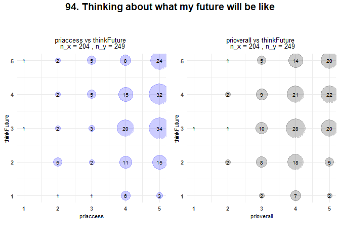

LEADS Bivariate Analysis - Mentorship
================
Rebecca Voropaeff
2024-10-08

<!-- insert LEADS logo -->

<!-- Load the data from the specified CSV file -->
<!-- assign factors -->
<!-- convert all columns within df to appropriate data types -->
<!-- assign specific order to surveytype -->
<!-- assign specific order to categories -->

This report observes the potential impact of mentorship on success
factors for LEADS scholars. The outcome Y variables of success factors
will be compared against the X variables *‘priaccess’* or *‘My primary
mentor of mentoring team is accessible’*, and *‘prioverall’* or *‘Please
rate the overall effectiveness of your primary mentor.’* The data is
unaggregated.

The LEADS survey has been broken down into subscales that will be
assessed in the tabs belows.

<!-- Load library for regression power analysis -->
<!-- Define a vector of specific question variables -->

## scatterplots

### Burnout

Burnout, shown on the y-axis, is measured on a Likert Scale of 1 to 5,
where 1 = None, 2 = Some Stress, 3 = Onset, 4 = Persistence, and 5 =
Severe. In this case, low scores indicate a positive result.

<!-- create function scatter plot two all -->

### Creativity

### Passion and Interests

Passion and Interest variables on the y-axis are measured on a Likert
Scale of 1 to 5, where 1 = Not at all, 2 = A little, 3 = Neutral, 4 = A
lot, 5 = Very Much.

### Leadership

Leadership variables on the y-axis are measured on a Likert Scale of 1
to 7, where 1 = Seldom and 7 = Almost Always.

### Research Skills Inventory

Research Skills Inventory variables on the y-axis are measured on a
Likert Scale of 0 to 10. Scholars were asked: Please indicate your
ability to successfully perform each task by selecting a single number
from 0 – 10 that best describes your level of confidence. We would like
to know how confident you are that you can successfully perform these
tasks TODAY where 0 = No confidence, 10 = Total confidence.

### Professionalism

Professionalism variables on the y-axis are measured on a Likert Scale
of 1 to 5, where 1 = Never and 5 = A great deal.

### Research Experience

Research experience, seen on the y-axis, is measured on a Likert Scale
of 0 to 5, where 0 = Has not changed at all, and 5 = Has changed a great
deal.

### Networking/Social Capital

Networking and social capital variables on the y-axis are measured on a
Likert Scale of 0 to 10, where 0 = Not at all, 10 = Completely.

### Job Satisfaction

Job satisfaction variables on the y-axis are measured on a Likert Scale
of 1 to 7, where 1 = Strongly disagree and 7 = Strongly agree.

### Career Satisfaction

Career satisfaction variables on the y-axis are measured on a Likert
Scale of 1 to 5, where 1 = Not satisfied, 5 = Very satisfied.

### Career Adapt-Abilities Inventory

Career Adat-Abilities Inventory variables on the y-axis are measured on
a Likert Scale of 1 to 5. Scholars were provided with the following
promt: Different people use different strength to build their careers.
No one is good at everything, each of us emphasizes some strengths more
than others. Please rate how strongly you have developed each of the
following abilities using the scale below where 1 = Not strong and 5 =
Strongest.

